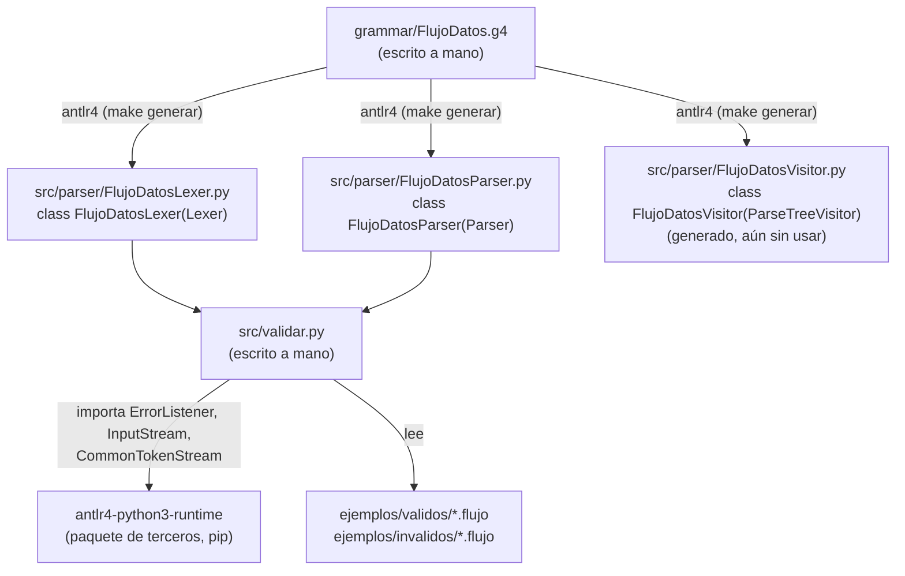

# Conceptos clave de ANTLR usados en este proyecto

Esta guía es material de apoyo para repasar, mientras se revisa el código, los fundamentos de
ANTLR que este proyecto usa (herencia entre clases, qué archivo genera
o importa a cuál). El documento de alcance (`documento_alcance.md`)
sigue siendo la referencia formal del diseño del lenguaje.

## 1. Lexer vs. parser, en una frase

- El **lexer** lee el archivo `.flujo` **caracter a caracter** y agrupa
  esos caracteres en **tokens** (p. ej. los caracteres `c`,`a`,`r`,...
  se agrupan en un token `CARGAR`). No sabe nada de la estructura del
  programa, solo de qué "palabras" existen.
- El **parser** lee la **secuencia de tokens** que produjo el lexer (ya
  no caracteres) y verifica que esa secuencia respete la gramática,
  construyendo un **árbol de análisis sintáctico** (parse tree).

En `grammar/FlujoDatos.g4` esto se ve en la convención de mayúsculas:
las reglas en MAYÚSCULA (`CARGAR`, `ID`, `STRING`, ...) son reglas de
**lexer**; las reglas en minúscula (`programa`, `sentencia`,
`expresion`, ...) son reglas de **parser**.

## 2. Qué genera el comando `antlr4` y de qué hereda cada cosa

Al ejecutar `make generar` (mediante `tools/generar.py`, que invoca el JAR de ANTLR con
`-Dlanguage=Python3 -visitor -o ../src/parser FlujoDatos.g4`
desde dentro de `grammar/`), ANTLR **lee el `.g4` y escribe código
Python nuevo** en `src/parser/`. Este código se versiona en
Git como entregable del Corte 1 y puede regenerarse desde la gramática.

| Archivo generado (en `src/parser/`) | Clase Python           | Hereda de           | ¿De dónde viene la clase base? |
|---|---|---|---|
| `FlujoDatosLexer.py`    | `FlujoDatosLexer`    | `Lexer`             | `antlr4` (paquete `antlr4-python3-runtime`) |
| `FlujoDatosParser.py`   | `FlujoDatosParser`   | `Parser`            | `antlr4` (paquete `antlr4-python3-runtime`) |
| `FlujoDatosVisitor.py`  | `FlujoDatosVisitor`  | `ParseTreeVisitor`  | `antlr4` (paquete `antlr4-python3-runtime`) |
| `FlujoDatosListener.py` | `FlujoDatosListener` | `ParseTreeListener` | `antlr4` (paquete `antlr4-python3-runtime`) |

La idea central: **`Lexer` y `Parser` (las clases base) contienen el
algoritmo genérico** de reconocimiento (simulación de autómatas sobre
una tabla de estados). **`FlujoDatosLexer` y `FlujoDatosParser` no
reimplementan ese algoritmo**; solo le "inyectan" la tabla concreta de
reglas de nuestro `.g4` (qué texto forma un `CARGAR`, qué secuencia de
tokens forma un `programa`, etc.). Por eso una gramática de 200 líneas
puede convertirse en cientos de líneas de Python generado sin que
nosotros hayamos escrito ese algoritmo: lo hereda del runtime.

En este corte solo usamos `FlujoDatosLexer` y `FlujoDatosParser`
(`FlujoDatosVisitor.py` se generó porque pasamos `-visitor`, pero no
se usa todavía; se implementará como base del intérprete en el
Corte 2 — ver la nota sobre alternativas etiquetadas en el `.g4`).

## 3. Mapa de dependencias entre archivos del repositorio



Léelo así: los archivos **con borde continuo escritos "a mano"**
(`FlujoDatos.g4` y `validar.py`) son el trabajo real del equipo. Todo
lo demás dentro de `src/parser/` es **generado**, y `validar.py` solo
lo *usa* por medio de un `import`, nunca lo edita.

## 4. Recorrido de `src/validar.py` en la práctica

Cuando se corre `python3 src/validar.py archivo.flujo`, pasa esto:

1. `Path.read_text(encoding="utf-8-sig")` lee la fuente UTF-8 con BOM
   opcional; `InputStream` entrega ese texto al lexer. Un error de lectura
   se reporta sin cancelar los archivos restantes.
2. `FlujoDatosLexer(entrada)` — generado — recorre ese texto y produce
   tokens (`CARGAR`, `STRING`, `ID`, `';'`, ...).
3. `CommonTokenStream(lexer)` — de `antlr4-python3-runtime` — actúa de
   buffer: le va pidiendo tokens al lexer y se los entrega al parser
   cuando este los pide.
4. `FlujoDatosParser(tokens)` — generado — y luego `parser.programa()`
   ejecuta la regla raíz del `.g4`, construyendo el árbol de análisis
   (un objeto `ProgramaContext`) o fallando con errores sintácticos.
5. `ColectorDeErrores` — escrito a mano en `validar.py`, hereda de
   `ErrorListener` (de `antlr4-python3-runtime`) — intercepta los
   errores léxicos y sintácticos que el lexer/parser habrían impreso
   por defecto, y los guarda en una lista para reportarlos con
   formato propio.

## 5. Por qué las alternativas etiquetadas (`# nombre`) del `.g4`
   importan para el Corte 2

Cuando una regla del parser tiene varias alternativas etiquetadas con
`# nombre` (como `fuenteDatos` o `expresion` en el `.g4`), ANTLR genera
**una subclase de contexto por alternativa**, todas heredando de la
clase de la regla. Por ejemplo, para `fuenteDatos`:

```
FuenteDatosContext            <- clase base de la regla
├── FuenteCargaContext        <- alternativa "cargaCSV"
├── FuentePipelineContext     <- alternativa "ID (PIPE operacion)+"
└── FuenteExpresionContext    <- alternativa "expresion"
```

Y en `FlujoDatosVisitor` (generado), aparece **un método por cada
subclase**: `visitFuenteCarga`, `visitFuentePipeline`,
`visitFuenteExpresion`. En el Corte 2, nuestra propia clase heredará de
`FlujoDatosVisitor` y sobreescribirá esos métodos para decidir qué
hacer con cada caso — sin tener que preguntar "¿qué alternativa fue?"
a mano, porque ANTLR ya lo resolvió llamando al método correcto.

## 6. Referencias rápidas

- [`grammar/FlujoDatos.g4`](../grammar/FlujoDatos.g4) — la gramática,
  con comentarios sección por sección.
- [`src/validar.py`](../src/validar.py) — el front-end en ejecución,
  con comentarios sobre cada import y cada paso del pipeline.
- [`documento_alcance.md`](documento_alcance.md) — alcance formal,
  gramática BNF/EBNF y justificación de cada decisión de diseño.


## 7. Resultado de análisis y consola

`analizar_texto()` devuelve un `Resultado` con el árbol completo y
diagnósticos tipados. No imprime y no ejecuta el DSL. `validar_archivo()`
se encarga de lectura y presentación; `main()` procesa argumentos y
devuelve un código de salida. Los tests importan el analizador mediante
`src.validar` y comprueban la consola en procesos separados.

La clase `ColectorDeErrores` recibe la etapa (léxico/sintáctico), conserva
los errores y convierte las columnas internas de ANTLR (desde cero) a
columnas públicas desde uno. El detalle de uso está en el README.
